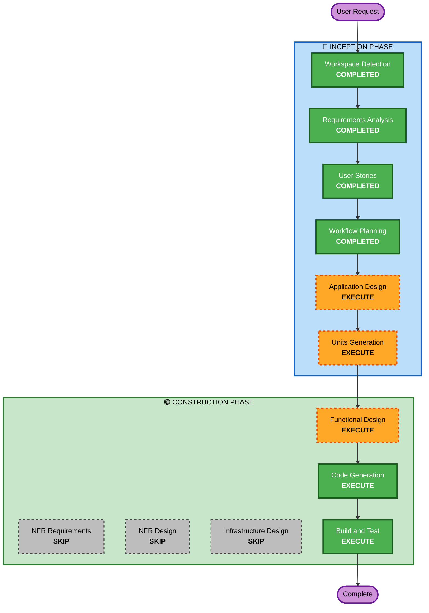

# Execution Plan — 오늘 하루, 수고했어

## Detailed Analysis Summary

### Change Impact Assessment
- **User-facing changes**: Yes — 전체가 사용자 대면 웹앱
- **Structural changes**: Yes — 새 프로젝트 아키텍처 수립 필요
- **Data model changes**: Yes — 일기 기록 데이터 모델 설계 필요
- **API changes**: Yes — Express 백엔드 API 설계 필요
- **NFR impact**: Yes — AI 응답 시간, 반응형 디자인

### Risk Assessment
- **Risk Level**: Medium (외부 API 의존: Bedrock, YouTube)
- **Rollback Complexity**: Easy (로컬 개발, 새 프로젝트)
- **Testing Complexity**: Moderate (AI 응답 모킹 필요)

## Workflow Visualization



### Text Alternative
```
Phase 1: INCEPTION
- Workspace Detection (COMPLETED)
- Requirements Analysis (COMPLETED)
- User Stories (COMPLETED)
- Workflow Planning (COMPLETED)
- Application Design (EXECUTE)
- Units Generation (EXECUTE)

Phase 2: CONSTRUCTION
- Functional Design (EXECUTE)
- NFR Requirements (SKIP)
- NFR Design (SKIP)
- Infrastructure Design (SKIP)
- Code Generation (EXECUTE)
- Build and Test (EXECUTE)
```

## Phases to Execute

### 🔵 INCEPTION PHASE
- [x] Workspace Detection (COMPLETED)
- [x] Requirements Analysis (COMPLETED)
- [x] User Stories (COMPLETED)
- [x] Workflow Planning (COMPLETED)
- [ ] Application Design - **EXECUTE**
  - **Rationale**: 새 프로젝트로 컴포넌트 구조, 서비스 레이어, API 설계 필요
- [ ] Units Generation - **EXECUTE**
  - **Rationale**: Frontend + Backend 두 개의 독립적 유닛으로 분해 필요

### 🟢 CONSTRUCTION PHASE
- [ ] Functional Design - **EXECUTE**
  - **Rationale**: AI 프롬프트 설계, 데이터 모델, API 계약 등 비즈니스 로직 상세 설계 필요
- [ ] NFR Requirements - **SKIP**
  - **Rationale**: 로컬 개발 MVP, 성능/보안 요구사항 최소, 보안 확장 비활성화
- [ ] NFR Design - **SKIP**
  - **Rationale**: NFR Requirements 스킵에 따라 자동 스킵
- [ ] Infrastructure Design - **SKIP**
  - **Rationale**: 로컬 개발 환경만 사용, 배포 인프라 불필요
- [ ] Code Generation - **EXECUTE** (ALWAYS)
  - **Rationale**: 실제 코드 구현
- [ ] Build and Test - **EXECUTE** (ALWAYS)
  - **Rationale**: 빌드 및 테스트 검증

## Success Criteria
- **Primary Goal**: 일기 작성 → AI 분석 → 플레이리스트 추천 전체 플로우 동작
- **Key Deliverables**: React 프론트엔드, Express 백엔드, Bedrock 연동, YouTube API 연동
- **Quality Gates**: 전체 사용자 여정 정상 동작, 감성 비주얼 렌더링
